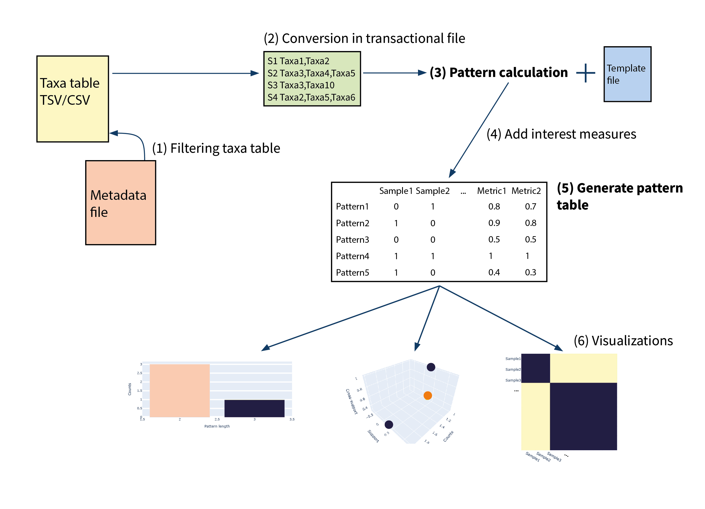
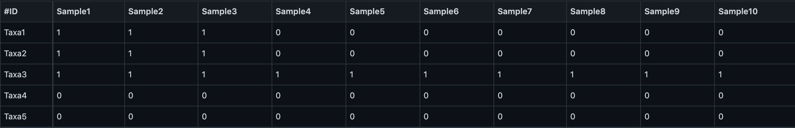

# microFIM

## Overview
microFim (microbial Frequent Itemset Mining) is a Python tool for the integration of Frequent Itemset Mining approach (also known as Association Rule Mining - ARM) into microbiome pattern analysis.
The tool is developed to create a bridge between microbial ecology researchers and ARM technique, integrating the common microbiome outputs (in particular, OTU and taxa table), metadata files typically used in microbiome analysis, and it provides similar microbiome outputs that help scientists to integrate ARM in microbiome applications. In detail, microFIM generates the **pattern table** - an OTU table built with the patterns extracted via ARM (see Figure above as an example)- that can be used to further statistical analysis, as biodiversity analysis based on distance metrics, and microbiome visualization strategies - as pattern-based heatmaps.

### ARM in a nutshel
(tbd)
[arm microbiome applications](arm_microbiome_applications.png)

Below, installation, instructions of use and tutorials are provided.

## Installation
1. Download Python 3 if you haven’t already at https://www.python.org/
2. Clone github repository (link: https://github.com/qLSLab/microFim.git) and:
    * Download ZIP from microFIM github home page, then decompress it\
    or 
    * Use git from command line: `git clone https://github.com/qLSLab/microFim.git`

3. We suggest to install Conda or Mininconda to run microFIM - here you can find how to install Miniconda3: https://conda.io/projects/conda/en/latest/user-guide/install/index.html

4. Once Miniconda is installed, create the conda environment with the command below: \
`conda create --name microFIM --file requirements.txt --channel default --channel conda-forge --channel plotly`

5. (Optional) Test microFIM before starting with your analysis - see Tutorial section for details

## Usage
microFIM can be used via guided scripts or python functions. \
Please see [microfim_tutorial_notebook](microfim_tutorial_notebook.ipynb) for complete tutorials for both usage.
Below, recomendations about input files format and explanation about the structure and functions module available.

### Input/output microFIM files
microFIM accepts as input taxa table in CSV format. An example of taxa table is provided in [tutorials](tutorials) (e.g. as test1.csv or test2.csv). In particular, the file is composed by the rows and columns representing the taxa with their abundances for each sample (visible also in the figure below). This kind of file derives from the conversion of the BIOM file into a CSV file (https://biom-format.org/). There are different ways to convert a BIOM file into a TSV or CSV file, at the end of the page we provide some options. In general, you can find taxa tables in different sources, as for example in QIITA platform (https://qiita.ucsd.edu/; Gonzales et al., 2018 [[1]](#1)) or in MLrepo (https://knights-lab.github.io/MLRepo/; Vangay et al., 2019 [[2]](#2)).
Considering microbiome analysis, QIIME2 provide complete frameworks and scripts to analyse and obtain taxa tables (https://qiime2.org/; Bolyen et al., 2019 [[3]](#3)).

#### Input description
Before starting with microFIM, be sure to set the following requirements for **inputs**:
* #ID \
In the taxa table, the column describing taxa must be filled as #ID. You can rename it with `sed -i 's/SEARCH_REGEX/REPLACEMENT/g' INPUTFILE` \
or a text editor;
* #SampleID \
If you want to filter your taxa table with a list of samples or metadata file, the column name must be filled as #SampleID; 
* CSV format \
Taxa table, metadata file and sample list file must be provided as CSV files. Template file is already defined as CSV in [input_templates](input_templates) directory.

#### Output description
* transactional file: taxa table is converted into a transactional file (see Figure below for an example), where each row represents a sample with the list of taxa it contains;
* pattern table as CSV: after pattern extraction, a presence-absence matrix is calculated, considering for each pattern if it is present or not in each sample - the results is similar to a taxa table, where the first column contains the patterns while the others describe in which sample are found. Columns considering the length of the patterns and their support are reported. Additional metrics can be also added (see Next section for details) - see the Figure below for an example;
* plots as SVG and HTML: visualizations as barplot, scatter plot and heatmap can be generated (see Next section for details)

### Structure
Guided scripts are defined in **6 main phases**, also represented in [microFIM_framework](microFIM_framework.jpg) figure.
In addition, we provided python function modules thascript_0_filtertable.pyt follow the previous structure. Here we describe the main steps and their respectives modules. For complete tutorials, see [microfim_tutorial_notebook](microfim_tutorial_notebook.ipynb). 
In particular:
* Step 1: **importing and filtering taxa table** - in the first phase you can filter your taxa table using the metadata file (via #SampleID column). 
If you want to run microFIM on your taxa table without filtering, go to the next step.
The script to filter is [script_0_filtertable.py](script_0_filtertable.py). 

* Step 2: **conversion into a transactional dataset** - taxa table (CSV) must be converted in a transactional file (see the previous description for details). The script to convert it [script_1_tableconversion.py](script_1_tableconversion.py).

* Step 3: **patterns extraction** - microFIM extract patterns from the transactional file (see previous step). To run [script_2_microfimcalculation.py](script_2_microfimcalculation.py), files with parameters must be given as input, you can find examples to be filled in [template_inputs](template_inputs).
The parameters to be filled are: 
   * minimum support;
   * minimum length;
   * maximum length.
We recomment to keep the option *report = [asS* in order to correctly used our scripts.

* Step 4: **integration of additional interest measures** - microFIM provides additional interest metrics to evaluate patterns, in particular all-Confidence is added. However, other metrics can be added. For each pattern, the value of the interes measure is added in a separate column, in order to guarantee further analysis and filtering steps. The script to calculate additional interest measures is [script_3_additionalmeasures.py](script_3_additionalmeasures.py). 

* Step 5: **creation of the pattern table** - similar to a taxa table, the pattern table describe the presence-absence of a pattern in the samples analysed. A CSV file is obtained. The script to obtain the pattern table is [script_4_generatepatterntable.py](script_4_generatepatterntable.py). 

* Step 6: **visualization of results** - from the pattern table, plot can be obtained. In particular, bar plot, scatter plot and heatmap are available. The standard output is SVG and HTML format. The script to generate visualizations is [script_5_generateplots.py](script_5_generateplots.py).

## Cite us
Link

## References
<a id="1">[1]</a> 
Gonzalez, A., Navas-Molina, J. A., Kosciolek, T., McDonald, D., Vázquez-Baeza, Y., Ackermann, G., ... & Knight, R. (2018). Qiita: rapid, web-enabled microbiome meta-analysis. Nature methods, 15(10), 796-798. \
<a id="2">[2]</a> 
Bolyen, E., Rideout, J. R., Dillon, M. R., Bokulich, N. A., Abnet, C. C., Al-Ghalith, G. A., ... & Caporaso, J. G. (2019). Reproducible, interactive, scalable and extensible microbiome data science using QIIME 2. Nature biotechnology, 37(8), 852-857. \
<a id="3">[3]</a> 
Vangay, P., Hillmann, B. M., & Knights, D. (2019). Microbiome Learning Repo (ML Repo): A public repository of microbiome regression and classification tasks. Gigascience, 8(5), giz042.
